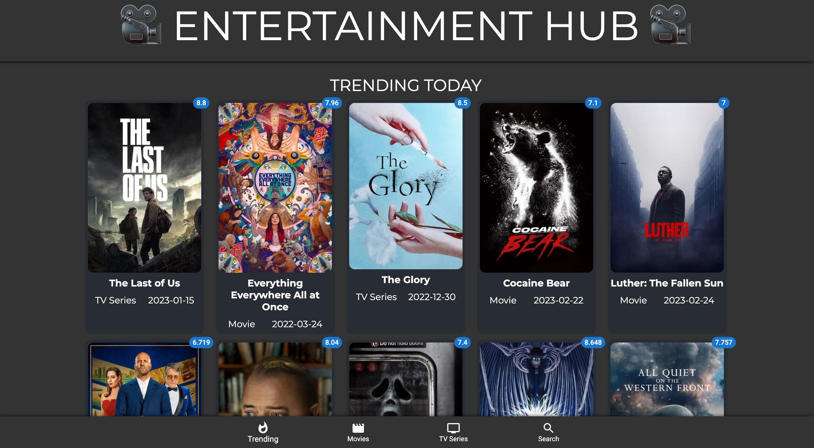
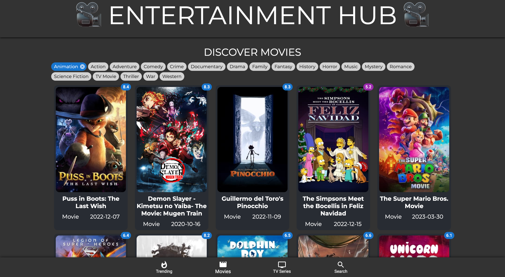
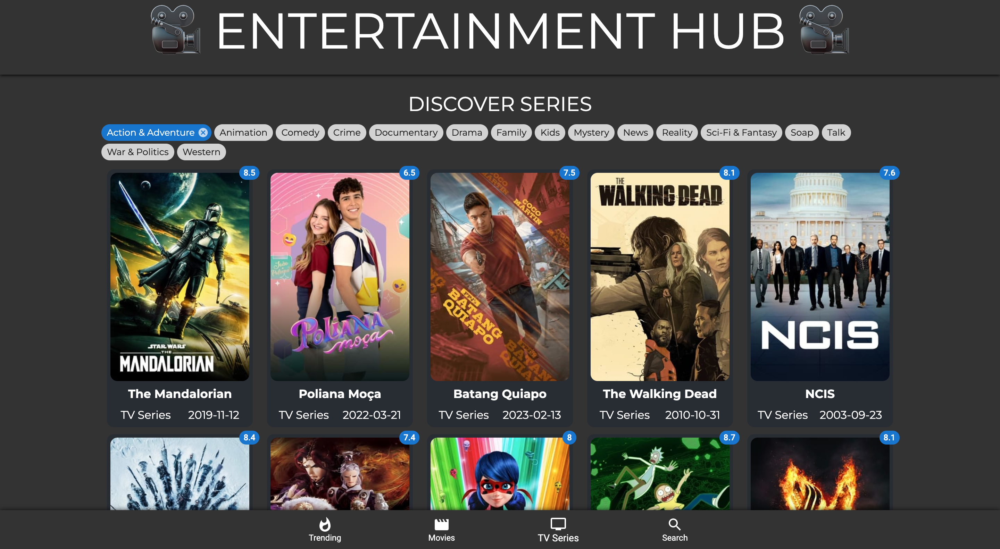
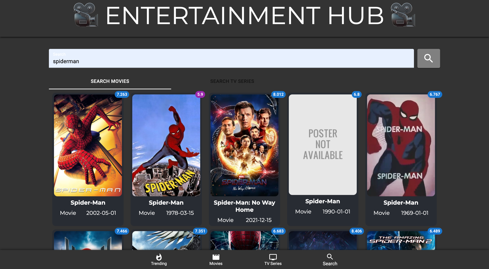

# EntertainmentHub - A movie searching app.
Link to project deployed with netlify. Live demo [here](https://abeers-entertainment-hub.netlify.app/)

## Table of Content
* General Information
* Technologies Used
* Features
* Screenshot
* Installation and Setup Instructions
* Usage
* Project Status
* Room for Improvement
* Acknowledgements
* Contact

## General Information
I created this movie search app using The MovieDB API. The app has a trending page, a movies page, a tv series page, and a search page. This project uses react-routing, MUI, CSS and react hooks, React Alice Carousel and Axios.

### Purpose of this project
To practice web design and routing.

## Technologies Used
* ReactJS
* HTML
* CSS
* JavaScript
* MUI
* React Hooks
* Webkit
* MovieDB API
* React Alice Carousel
* React Router Dom
* Axios

## Features
* React-routing.
* A Trending page. 
* A Movies page
* A TV Series page
* A Search page
* Modal that presents detailed infor about media
* The ability to filter media by category
* The ability to search Movies or TV Series
* Pagination
* Responsive design

## Screenshot
Trending Page

Movies Page

TV Series Page

Search Page (Scrolled)

Details Modal

## Installation and Setup Instructions

Clone down this repository. You will need node and `npm` installed globally on your machine.

### Installation:

`npm install`

To Run Test Suite:

`npm test`

To Start Server:

`npm start`

To Visit App:

`localhost:3000/`

## Usage

**Trending Page**

* The trending page displays movies trending during the week from The MovieDB API with pagination. 

**Movies Page**

* The movies page displays movies from The MovieDB API. You can sort through the movies from the categories chips at the top. Each movie poster displays a color coded ratings badge.

**TV Series Page**

* The tv series page displays series from The MovieDB API. You can sort through the series from the categories chips at the top. Each series poster displays a color coded ratings badge.

**Search Page**

* The search page displays a search bar and two tabs, one for movies and one for series. 

**Modal**

* One clicking on any show a modal opens up displaying details about the show, a carousel of the actors, and a button that plays the show trailer.

**Responsive Design**

* This app has a responsive design.

## Project Status
Project is: Completed

## Room for Improvement
* Enhance page design.

## Acknowledgements
* Many thanks to the coding online community.

## Contact
Created by Abeer Ahmed [LinkedIn profile](https://www.linkedin.com/in/abeerdev/) - feel free to contact me.

